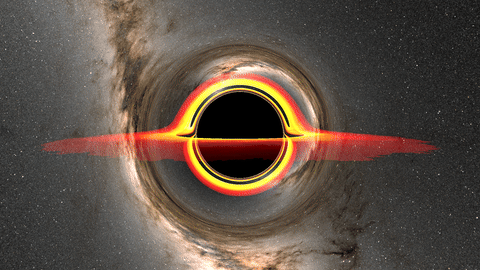

# General Relativity Raytracing

## Структура проекта

```
.
├── CMakeLists.txt        # конфигурация сборки, подтягивает stb и tinyexr через FetchContent
├── background.exr        # HDR-панорама фона, на который проецируются улетевшие лучи
├── src/
│   ├── main.cpp           # точка входа: рендер одного кадра + последовательности облёта
│   ├── core/
│   │   ├── Constants.h       # константы: PI, RECIP_PI
│   │   └── Vec3.h/.cpp    # базовые типы: Vec3 (x, y, z)
│   ├── physics/
│   │   ├── physics.h/.cpp    # интегрирование геодезического уравнения, трассировка одного луча (traceRay), HitInfo
│   └── render/
│       ├── Renderer.h/.cpp      # трассировка всех лучей кадра (traceRays), запись PNG (writeImage/renderImage)
│       ├── Background.h/.cpp    # загрузка background.exr и сэмплирование фона по направлению луча
│       ├── AccretionDisc.h/.cpp # цвет точки аккреционного диска (discColor)
│       └── PerlinNoise.h/.cpp   # процедурный шум, используется для текстуры диска
├── tools/
│   ├── wsl-profile.sh     # сборка + профилирование через perf в WSL
│   └── FlameGraph/        # скрипты для флеймграфов (подтягиваются скриптом, в git не хранятся)
├── seq/                   # сгенерированные PNG-кадры облёта (output_<n>.png), в git не хранятся
└── cmake-build-*/         # директории сборки CMake/CLion, в git не хранятся
```
